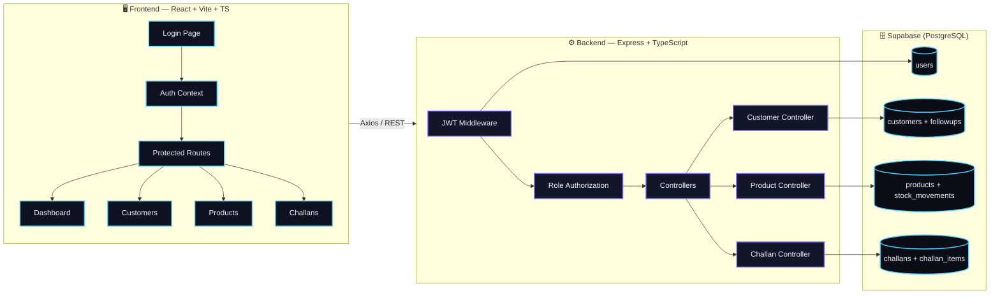
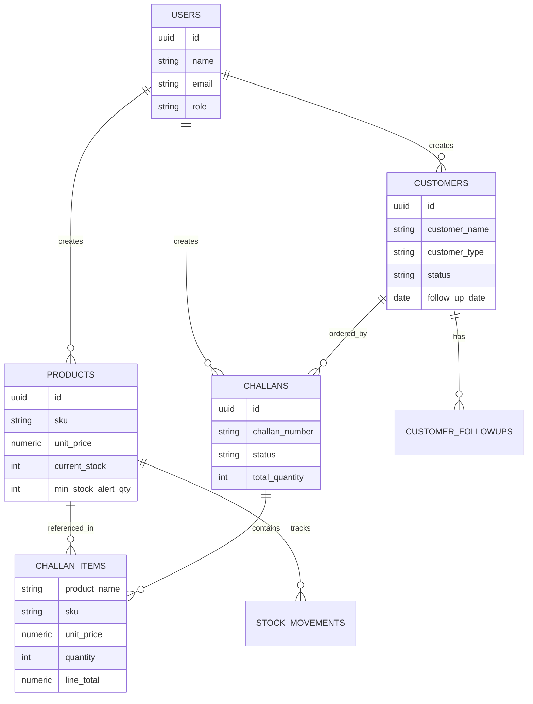

<div align="center">

# 🏢 Mini ERP + CRM Operations Portal

### A full-stack, role-based operations platform for Customers, Inventory & Sales Challans

[](https://www.typescriptlang.org/)
[](https://react.dev/)
[](https://nodejs.org/)
[](https://expressjs.com/)
[](https://supabase.com/)
[](https://vitejs.dev/)
[](https://render.com/)

**A production-style ERP/CRM built to demonstrate real-world backend architecture, role-based access control, and clean full-stack engineering.**

### 🔗 Live Demo

| | |
|---|---|
| 🖥️ **Frontend** | [_add your deployed Vercel/Netlify URL here_](#) |
| ⚙️ **Backend API** | [_add your deployed Render URL here_](#) |

[Overview](#-overview) • [Features](#-features) • [Architecture](#-architecture) • [Tech Stack](#-tech-stack) • [Getting Started](#-getting-started) • [API Reference](#-api-reference) • [Roles](#-role-based-access-control) • [Postman](#-postman-collection)

</div>

---

## 📖 Overview

**Mini ERP + CRM** is a lightweight but realistic **Operations Portal** for a small trading/distribution business. It merges three modules that usually live in separate systems — **CRM (customers)**, **Inventory (products & stock)**, and **Sales Dispatch (challans)** — into one clean, role-secured application.

> 💡 Built to showcase practical backend design: JWT auth, RBAC middleware, transactional stock updates, and a typed REST API consumed by a React SPA.

```
👤 Login → 🔐 JWT Issued → 🧭 Role-Based Dashboard → 📋 CRM · 📦 Inventory · 🚚 Challans
```

---

## ✨ Features

| Module | What it does |
|---|---|
| 🔐 **Authentication** | JWT-based login, bcrypt password hashing, protected routes |
| 👥 **CRM (Customers)** | Lead → Active → Inactive pipeline, follow-up notes & reminders, GST/business info |
| 📦 **Inventory** | SKU-based product catalog, stock IN/OUT movement ledger, low-stock alerts |
| 🚚 **Sales Challans** | Draft → Confirmed → Cancelled dispatch flow with **snapshotted line items** |
| 📊 **Dashboard** | Live counts for customers, products, low-stock items & draft challans |
| 🛡️ **RBAC** | 4 distinct roles, each scoped to the actions they should actually perform |
| 🌐 **REST API** | Fully documented via an included Postman collection |

---

## 🧭 Architecture



### 🔄 Sales Challan Lifecycle

```mermaid
stateDiagram-v2
    [*] --> Draft: Sales creates challan
    Draft --> Confirmed: Sales/Warehouse confirms dispatch
    Draft --> Cancelled: Sales cancels
    Confirmed --> [*]
    Cancelled --> [*]

    classDef default fill:#121629,stroke:#4fd1ff,stroke-width:1.5px,color:#f3f5fb;
```

---

## 🛡️ Role-Based Access Control

Four roles, each scoped to real operational responsibilities:

| Action | 👑 Admin | 💼 Sales | 🏭 Warehouse | 💰 Accounts |
|---|:---:|:---:|:---:|:---:|
| View customers | ✅ | ✅ | ✅ | ✅ |
| Create / edit customers | ✅ | ✅ | ❌ | ❌ |
| Add follow-ups | ✅ | ✅ | ❌ | ❌ |
| View products | ✅ | ✅ | ✅ | ✅ |
| Create / edit products & stock | ✅ | ❌ | ✅ | ❌ |
| View challans | ✅ | ✅ | ✅ | ✅ |
| Create challans | ✅ | ✅ | ❌ | ❌ |
| Confirm challans | ✅ | ✅ | ✅ | ❌ |
| Cancel challans | ✅ | ✅ | ❌ | ❌ |

> Enforced server-side via an `authorize(...roles)` middleware on every route — not just hidden in the UI.

---

## 🧱 Tech Stack

<table>
<tr>
<td valign="top" width="50%">

### Frontend
- ⚛️ **React 18** + **TypeScript**
- ⚡ **Vite** for dev/build tooling
- 🧭 **React Router v6** for routing
- 🌐 **Axios** for API communication
- 🎨 Hand-crafted CSS design system (dark UI, blue/violet accent theme)

</td>
<td valign="top" width="50%">

### Backend
- 🟢 **Node.js 22** + **Express**
- 🛡️ **JWT** + **bcryptjs** for auth
- ✅ **express-validator** for input validation
- 🪖 **Helmet** + **CORS** + **Morgan** for security/logging
- 🗄️ **Supabase (PostgreSQL)** as the data layer

</td>
</tr>
</table>

---

## 🗂️ Data Model



> 📌 **Design highlight:** `challan_items` stores a **snapshot** of product name, SKU & price at the time of dispatch — so historical challans stay accurate even if a product is later renamed or repriced.

---

## 🚀 Getting Started

### 1️⃣ Prerequisites
- Node.js `22.x`
- A free [Supabase](https://supabase.com) project

### 2️⃣ Database Setup
```bash
# Run backend/db/schema.sql inside your Supabase SQL Editor
```

### 3️⃣ Backend Setup
```bash
cd backend
cp .env.example .env      # fill in SUPABASE_URL, SUPABASE_SERVICE_ROLE_KEY, JWT_SECRET
npm install
npm run seed               # creates one demo user per role
npm run dev                # starts on http://localhost:5000
```

### 4️⃣ Frontend Setup
```bash
cd frontend
cp .env.example .env       # set VITE_API_BASE_URL
npm install
npm run dev                # starts on http://localhost:5173
```

### 🔑 Demo Credentials (after seeding)

| Role | Email | Password |
|---|---|---|
| 👑 Admin | `admin@erp.com` | `Password@123` |
| 💼 Sales | `sales@erp.com` | `Password@123` |
| 🏭 Warehouse | `warehouse@erp.com` | `Password@123` |
| 💰 Accounts | `accounts@erp.com` | `Password@123` |

---

## 📡 API Reference

| Method | Endpoint | Roles | Description |
| :--- | :--- | :--- | :--- |
| `POST` | `/api/auth/login` | Public | Login and receive JWT |
| `GET` | `/api/auth/me` | All | Current user profile |
| `GET` | `/api/customers` | All | Paginated customer list with search & status/type filters |
| `POST` | `/api/customers` | Admin, Sales | Create customer |
| `GET` | `/api/customers/:id` | All | Customer details and follow-ups |
| `PUT` | `/api/customers/:id` | Admin, Sales | Update customer |
| `POST` | `/api/customers/:id/followups` | Admin, Sales | Add follow-up note |
| `GET` | `/api/products` | All | Paginated product list with search & `lowStock` filter |
| `POST` | `/api/products` | Admin, Warehouse | Create product |
| `PUT` | `/api/products/:id` | Admin, Warehouse | Update product |
| `POST` | `/api/products/:id/stock-movement` | Admin, Warehouse | Manual stock adjustment (logs IN/OUT movement) |
| `GET` | `/api/challans` | All | Paginated challan list with status filter |
| `POST` | `/api/challans` | Admin, Sales | Create challan (Draft or Confirmed) |
| `GET` | `/api/challans/:id` | All | Challan details with item snapshots |
| `PATCH` | `/api/challans/:id/confirm` | Admin, Sales, Warehouse | Confirm challan & deduct stock |
| `PATCH` | `/api/challans/:id/cancel` | Admin, Sales | Cancel challan & restore stock if needed |

> All routes (except login) require a `Bearer` JWT and are gated by the RBAC middleware. List endpoints support `page`, `limit`, `search`, and resource-specific filters.

---

## 📬 Postman Collection

A ready-to-import collection is included at [`/postman/Mini_ERP_CRM.postman_collection.json`](./postman/Mini_ERP_CRM.postman_collection.json).

**How to use it:**

1. Open Postman → **Import** → select the collection file above.
2. Create (or edit) an environment with a `baseUrl` variable set to:
   - `http://localhost:5000/api` for local development, or
   - your deployed Render API URL (e.g. `https://your-backend.onrender.com/api`)
3. Run the **Login** request with any demo role from the table above — the response returns a JWT.
4. Copy that token into an `authToken` environment variable.
5. Every other request in the collection sends `Authorization: Bearer {{authToken}}` automatically, so all Customer / Product / Challan endpoints are ready to call immediately.

> 💡 Tip: switch `authToken` between roles (Admin, Sales, Warehouse, Accounts) to see the RBAC middleware return `403 Forbidden` on actions a role isn't allowed to perform.

---

## 🗄️ Database Tables

- `users`
- `customers`
- `customer_followups`
- `products`
- `stock_movements`
- `challans`
- `challan_items`

---

## ☁️ Deployment Notes

| Layer | Platform | Notes |
| :--- | :--- | :--- |
| Frontend | **Vercel** *(or Netlify)* | Static build from `frontend/dist`, SPA rewrite configured in `vercel.json` |
| Backend | **Render** | Node/Express web service, env vars set in the Render dashboard |
| Database | **Supabase** | Managed PostgreSQL, schema applied via `db/schema.sql` |

To deploy your own copy:
1. Push the repo to GitHub.
2. Create a Supabase project → run `db/schema.sql` → copy the project URL & service role key.
3. Deploy `backend/` to Render as a Node web service; set `SUPABASE_URL`, `SUPABASE_SERVICE_ROLE_KEY`, `JWT_SECRET`, `CORS_ORIGIN`.
4. Deploy `frontend/` to Vercel; set `VITE_API_BASE_URL` to the Render API URL before building.
5. Run `npm run seed` once against the deployed backend (or locally pointed at the same Supabase project) to create demo users.
6. Drop your live URLs into the [🔗 Live Demo](#-live-demo) table at the top of this README.

---

## 📁 Project Structure

```
mini-erp-crm/
├── 🖥️ frontend/
│   └── src/
│       ├── api/          # Axios instance + interceptors
│       ├── components/   # Layout, ProtectedRoute, Footer
│       ├── context/       # AuthContext (JWT/session)
│       ├── pages/         # Dashboard, Customers, Products, Challans, Login
│       └── styles/        # Design system CSS
├── ⚙️ backend/
│   └── src/
│       ├── config/         # Supabase client
│       ├── controllers/    # Business logic per module
│       ├── middleware/     # authenticate, authorize, errorHandler
│       ├── routes/         # Express route definitions
│       └── utils/          # apiError, asyncHandler, seed script
│   └── db/
│       └── schema.sql      # Full PostgreSQL schema
└── 📬 postman/              # API collection for testing
```

---

## 📝 Notes & Known Limitations

- Monetary values are formatted as INR only; multi-currency is not supported.
- Product details are snapshotted into `challan_items` so historical challans stay accurate even after catalog changes.
- Stock checks on confirm rely on an application-level read-then-write check rather than a DB-level `FOR UPDATE` row lock, so a rare race condition is theoretically possible under concurrent confirms on the same product.
- Pagination uses basic offset/limit, which may need cursor-based pagination at very large record counts.

---

## 🗺️ Roadmap

- [ ] Invoice generation from confirmed challans
- [ ] CSV export for inventory & sales reports
- [ ] Email notifications for low-stock & follow-up reminders
- [ ] Unit + integration test suite

---

<div align="center">

### 🙌 Built as a full-stack showcase of RBAC, transactional data design & clean API architecture

⭐ If you found this project interesting, consider giving it a star!

</div>